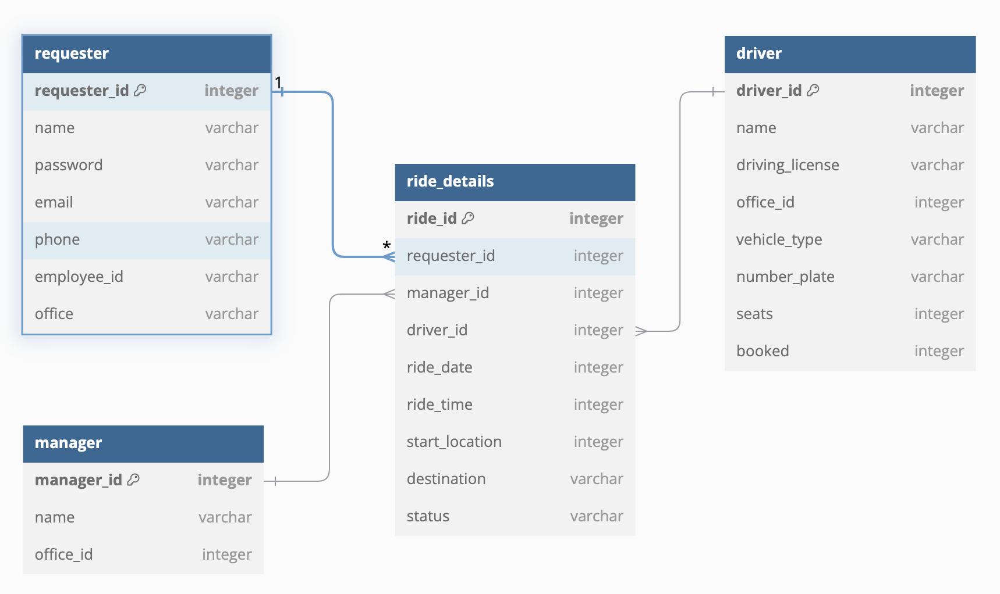

# Simple Yatra Application - Backend Service

## Database Diagram

## API Endpoints

[Swagger UI](http://localhost:9091/swagger-ui/index.html)

### Requester Management

- [x] `GET /requesters/hello`: Test endpoint for Spring Security.
- [x] `GET /requesters/{id}`: Retrieve requester details by id.
- [x] `GET /requesters`: Retrieve a list of all requesters.
- [x] `GET /requesters?email={email}`: Retrieve requester details by email.
- [x] `POST /requesters`: Register a new requester.
- [x] `PUT /requesters`: Update requester details.
- [x] `DELETE /requesters/{id}`: Delete a requester by id.
